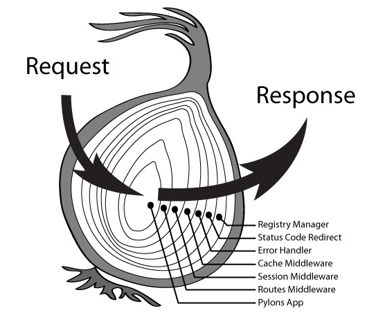

## 安装

> npm i koa -g

## 中间件 middleawre

```js
// 此处有三个中间件， 每一次到await 的时候，往下一个中间件走
app.use(async (ctx, next) => {
  console.log('1 start')
  // 如果没有 await next 就不会再去调用下一个中间件
  await next()
  console.log('1 end')
})
app.use(async (ctx, next) => {
  console.log('2 start')
  // 如果没有 await next 就不会再去调用下一个中间件
  await next()
  console.log('2 end')
})
app.use(async (ctx, next) => {
  console.log('3 start')
  // 如果没有 await next 就不会再去调用下一个中间件
  await next()
  console.log('3 end')
})

/*
 * 1
 * 2
 * 3
 * 3
 * 2
 * 1
 */
```

看图说话



## koa 路由

也是采用中间件的形式，如果不使用三方库，则代码是这样的

```js
// 中间件 1
app.use(async (ctx, next) => {
  if (ctx.request.path === '/') {
    ctx.body = `<h1>index page</h1>`
  } else {
    await next()
  }
})

// 中间件 2
app.use(async (ctx, next) => {
  if (ctx.request.path === '/home') {
    ctx.response.body = `<h1>home page</h1>`
  } else {
    await next()
  }
})

// 中间件 3
app.use(async (ctx, next) => {
  if (ctx.request.path === '/404') {
    ctx.response.body = `<h1>404 page</h1>`
  } else {
    await next()
  }
})
```

`koa-router`

- 支持路由分层
- 链式调用
- 多中间件
- 路由前缀
- url 参数

```js
const Router = require('koa-router')
const router = new Router()
const apis = new Router()
const views = new Router({
  // 路由前缀，写这里和use 写的功能一样 ，但是前缀不能是动态参数
  prefix: '/view'
})

// 支持链式调用
views
  .get('/', async (ctx, next) => {
    ctx.response.body = `<h1>index page</h1>`
  })
  .get('/home', async (ctx, next) => {
    ctx.response.body = `<h1>home page</h1>`
  })
  .get('/user/:id', async (ctx, next) => {
    // 支持动态路径
    ctx.response.body = `user:${ctx.params.id}`
  })
  .get(
    '/404',
    async (ctx, next) => {
      ctx.response.status = 404
      // 此处一定要调用
      await next()
    },
    async (ctx, next) => {
      console.log('多中间件')
      ctx.response.body = `<h1>404 page</h1>`
    }
  )

apis.post('/upload', async ctx => (ctx.response.body = 'upload'))

// 支持路由分层
router.use('/view', views.routes())
router.use('/api', apis.routes())

module.exports = router
```

## 响应浏览器请求

#### URL query 参数

`www.xx.com?id=123`  
`ctx.query` 或者`querystring` 可以直接去到`GET`参数，`query` 取出的是对象，`querystring`取出的是 字符串

#### URL params 参数

首先需要定义参数

```js
router.get('/user/:id', async (ctx, next) => {
  // 支持动态路径
  ctx.response.body = `user:${ctx.params.id}`
})
```

```js
ctx.params
// 就可以取出对象了
{
  id: 123
}
```

#### post 请求 参数

使用中间件 `koa-bodyparser`

npm i koa-bodyparser

_一定要在路由中间件之前使用_

```js
// body 解析中间件 默认仅解析 "application/x-www-form-urlencoded" "application/json"
app.use(bodyParser())
```

#### post 图片上传

使用 koa-body 获取文件

npm i koa-body

```js
// 局部中间件 也可以作为全局中间件
router.post(
  '/users',
  koaBody({
    // 解析 body 体
    multipart: true,
    formidable: {
      maxFileSize: 200 * 1024 * 1024 // 设置上传文件大小最大限制，默认2M
    }
  }),
  ctx => {
    console.log(ctx.request.body)
    // 上传单个文件
    const file = ctx.request.files.file // 获取上传文件
    // 创建可读流
    const reader = fs.createReadStream(file.path)
    let filePath = path.join(__dirname, 'public/upload/') + `/${file.name}`
    // 创建可写流
    const upStream = fs.createWriteStream(filePath)
    // 可读流通过管道写入可写流
    reader.pipe(upStream)
    return (ctx.body = '上传成功！')
  }
)
```

- 新版本的 koa-body 通过 ctx.request.files 获取上传的文件
- 旧版本的 koa-body 通过 ctx.request.body.files 获取上传的文件

#### 分层

│  
├── public/  
├── index.js  
├── src/ 开发目录  
├──── controller/ 控制器  
│ ├── router/  
│ ├── service/  
│ ├── views/  
├── package.json  
│

#### 视图模板

npm i koa-nunjucks-2

```js
// view 中间件
app.use(
  koaNunjucks({
    ext: 'html',
    path: path.join(__dirname, 'src/views'),
    nunjucksConfig: {
      trimBlocks: true
    }
  })
)
```

#### static 静态资源

npm i koa-static

```js
// use 并 指定 路径
app.use(koaStatic(path.join(__dirname, 'public')))
```

#### 封装 JSON 数据

封装中间件发送 json 的统一方法，封装统一格式

```js
// middleware/jsonsend.js
module.exports = async (ctx, next) => {
  ctx.send = (statusCode = 1, data = {}, message = 'success') => {
    ctx.set('Content-Type', 'application/json')
    ctx.body = JSON.stringify({
      status: statusCode,
      data,
      message
    })
  }
  await next()
}
```

#### 日志记录

log4js

- 日志分类
  - 访问日志
  - 应用日志
- 日志等级
  - ALL
  - TRACK
  - DEBUG
  - INFO
  - WARN
  - ERROR
  - FATAL
  - MARK
  - OFF 不输出日志
- 日志切割

简单封装成日志中间件

```js
const log4js = require('log4js')
const path = require('path')

// 可配置项
const logConfig = {
  dir: path.join(__dirname, '../../logs'),
  infoLeave: 'info'
}

// 所有日志级别 生成一个方法到上下文中
const methods = ['trace', 'debug', 'info', 'warn', 'error', 'fatal', 'mark']

// log4js 配置
log4js.configure({
  appenders: {
    cheese: {
      type: 'dateFile', // 日志类型
      filename: `${logConfig.dir}/task`, // 输出的文件名
      pattern: '-yyyy-MM-dd.log', // 文件名增加后缀
      alwaysIncludePattern: true // 是否总是有后缀名
    }
  },
  // 日志级别
  categories: {
    default: {
      appenders: ['cheese'],
      level: logConfig.infoLeave
    }
  }
})

module.exports = async (ctx, next) => {
  // 生成日志实例
  const logger = log4js.getLogger('cheese')
  // 上下文日志
  const contenxtLog = {}

  methods.forEach(v => {
    // 每一个日志级别给一个方法
    contenxtLog[v] = message => {
      logger[v](message)
    }
  })
  // 挂载到 context 上下文中
  ctx.log = contenxtLog

  await next()
}
```

#### 错误处理

中间件处理 error

```js
module.exports = async (ctx, next) => {
  try {
    await next()

    // 如果状态码 404 且 body 没有任何东西 认为错误
    if (ctx.response.status === 404 && !ctx.response.body) ctx.throw(404)
  } catch (e) {
    const status = parseInt(e.status)
    const msg = e.message
    if (status >= 400) {
      switch (status) {
        case 404:
        case 400:
        case 500:
          ctx.body = msg
          ctx.log.error(`${status} ${+new Data()}`)
        default:
          break
      }
    } else {
    }
  }
}
```

- 404
- 500

app 监听错误
```js
// 增加错误的监听处理
app.on('error', (err, ctx) => {
  if (ctx && !ctx.headerSent && ctx.status < 500) {
    ctx.status = 500
    ctx.log.error(err.stack)
  }
})
```